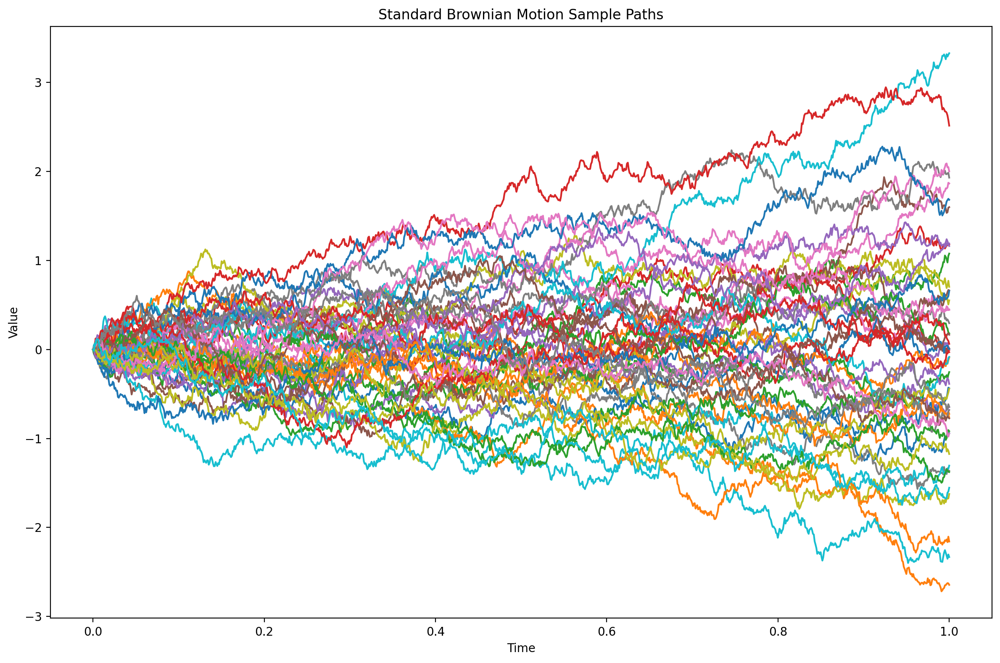
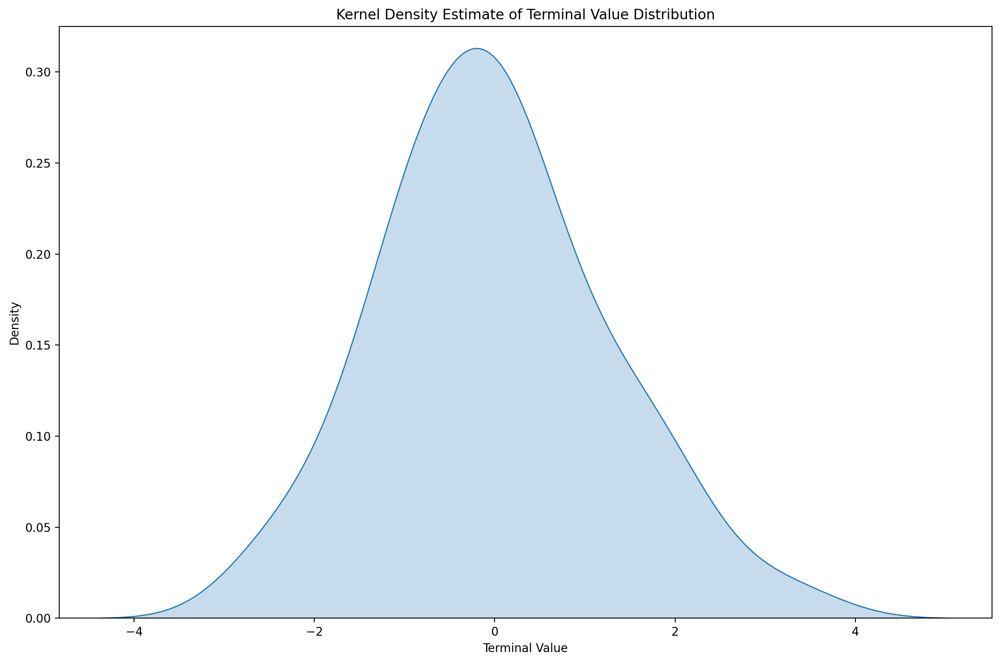
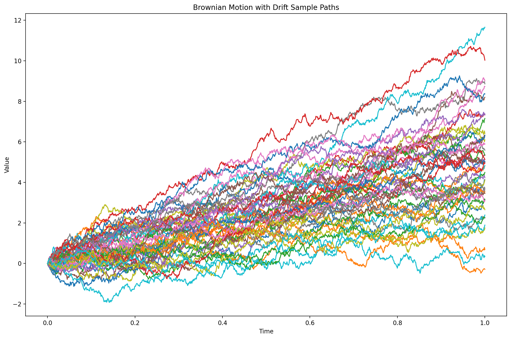

# Brownian Motion Simulator

A compact scientific Python project to simulate and visualize Brownian motion sample paths.

The repository currently includes:
- a standard Brownian motion simulation
- a Brownian motion with drift simulation
- visualizations for sample paths and terminal value distribution

## Preview

### Standard Brownian Motion Sample Paths



### Terminal Value Distribution



### Brownian Motion with Drift Sample Paths



## Tech Stack

- Python 3.12
- NumPy
- pandas
- matplotlib
- seaborn
- uv

## Run Locally

Install dependencies:

```bash
uv sync
```

Run the project:

```bash
uv run python main.py
```

This command generates the figures in the `figures/` folder.

You can also run the simulation script directly:

```bash
uv run python brownian_motion_sim.py
```

The direct script entry point supports command-line arguments for the main simulation settings:

```bash
uv run python brownian_motion_sim.py --points 2000 --paths 100 --seed 7 --output-dir figures
```

Available options include `--points`, `--paths`, `--interval_start`, `--interval_end`, `--seed`, and `--output-dir`.

## Project Goal

This project explores:
- stochastic processes
- Brownian motion path construction
- the effect of drift and diffusion on trajectories
- basic scientific plotting in Python

## Possible Next Steps

- add input validation for command-line arguments
- add tests for simulation shapes and reproducibility
- compare empirical terminal distributions with theoretical results
